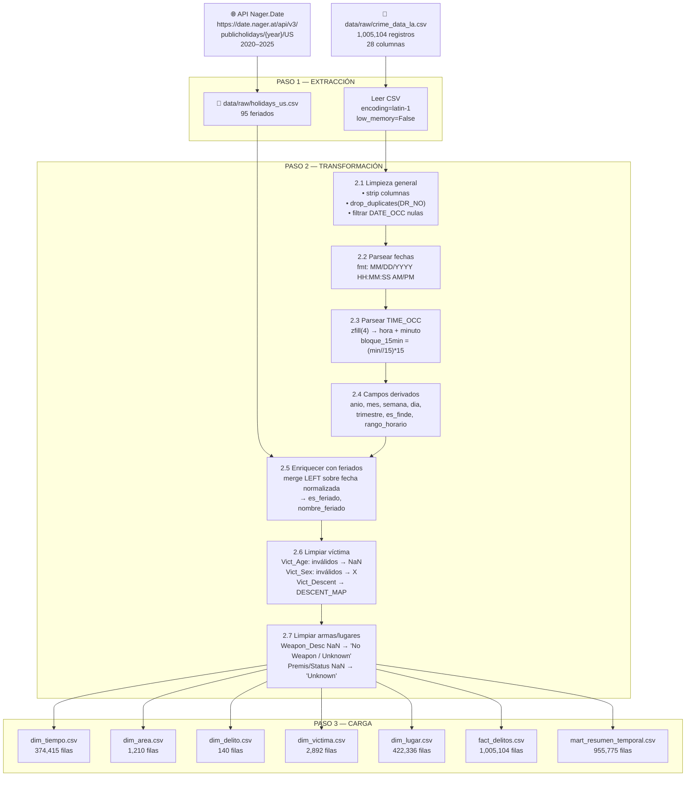

# Resumen ETL — Los Angeles Crime Data
**Proyecto 1 BI — Business Analytics, Primer Semestre 2026**
**Profesora:** Carla Vairetti — Universidad de los Andes
**Script:** `etl/pipeline.py`
**Fecha de ejecución:** 2026-03-29

---

## 1. Fuentes de Datos Utilizadas

### 1.1 Fuente Principal — LA Crime Data

| Campo | Detalle |
|---|---|
| **Nombre** | Crime Data from 2020 to Present |
| **Origen** | [data.lacity.org](https://data.lacity.org/Public-Safety/Crime-Data-from-2020-to-Present/2nrs-mtv8/about_data) |
| **Archivo local** | `data/raw/crime_data_la.csv` |
| **Formato** | CSV con separador coma, encoding latin-1 |
| **Tamaño** | 1,005,104 registros, 28 columnas |
| **Rango temporal** | 01/01/2020 — 01/03/2025 |
| **Granularidad** | Un registro por incidente policial (DR_NO único) |

Las fechas vienen en formato `MM/DD/YYYY HH:MM:SS AM/PM`. La hora del delito (`TIME_OCC`) es un entero de 1–4 dígitos que representa HHMM (ej: `42` = 00:42, `737` = 07:37, `1931` = 19:31).

### 1.2 Fuente Secundaria — Feriados Federales EE.UU.

| Campo | Detalle |
|---|---|
| **Nombre** | US Public Holidays 2020–2025 |
| **Origen** | API pública Nager.Date: `https://date.nager.at/api/v3/publicholidays/{year}/US` |
| **Archivo local** | `data/raw/holidays_us.csv` |
| **Formato** | JSON → CSV (columnas: `date`, `localName`, `name`) |
| **Tamaño** | 95 registros (feriados 2020–2025) |
| **Años cubiertos** | 2020, 2021, 2022, 2023, 2024, 2025 (15–16 feriados por año) |

---

## 2. Transformaciones Realizadas

### 2.1 Limpieza General
- **Normalización de nombres de columna:** se eliminaron espacios y se reemplazaron por `_` para facilitar el acceso en Python (`df.columns.str.strip().str.replace(' ', '_')`).
- **Eliminación de duplicados:** se identificaron y eliminaron filas con `DR_NO` duplicado (0 duplicados encontrados en este dataset).
- **Filtro de fechas nulas:** se eliminaron registros sin `DATE_OCC` (0 eliminados).

### 2.2 Transformación de Fechas
Las columnas `DATE_OCC` y `Date_Rptd` venían con formato completo `MM/DD/YYYY HH:MM:SS AM/PM`. Se parsearon con `pd.to_datetime(..., format='%m/%d/%Y %I:%M:%S %p')`. Los 1,005,104 registros se convirtieron exitosamente (0 inválidos).

**Por qué:** Power BI requiere fechas en formato datetime nativo para habilitar jerarquías temporales (año → mes → semana → día).

### 2.3 Transformación de Hora (TIME_OCC)
La columna `TIME_OCC` viene como entero sin padding (ej: `42`, `737`, `1931`). Se rellenó con ceros a la izquierda (`zfill(4)`) y se extrajeron `hora` (HH) y `minuto` (MM). Se calculó además el `bloque_15min` = `(minuto // 15) * 15`.

**Por qué:** Permite análisis de patrones intradiarios con granularidad de 15 minutos, necesario para KPIs de hora pico.

### 2.4 Campos Temporales Derivados
A partir de `DATE_OCC` se generaron:

| Campo | Cálculo | Propósito |
|---|---|---|
| `anio` | `.dt.year` | Filtro anual |
| `mes` | `.dt.month` | Filtro mensual |
| `nombre_mes` | `.dt.strftime('%B')` | Etiqueta legible |
| `semana_anio` | `.dt.isocalendar().week` | Análisis semanal |
| `dia_semana` | `.dt.dayofweek` (0=Lun) | Análisis por día |
| `nombre_dia` | `.dt.strftime('%A')` | Etiqueta legible |
| `dia_mes` | `.dt.day` | Granularidad diaria |
| `trimestre` | `.dt.quarter` | Agrupación trimestral |
| `es_finde` | `dia_semana ∈ {5,6}` → 1/0 | KPI fin de semana |
| `rango_horario` | Madrugada/Mañana/Tarde/Noche | Segmentación horaria |

**Por qué:** Evita calcular estos campos en Power BI (costoso en DAX), pre-computarlos acelera los dashboards.

### 2.5 Enriquecimiento con Feriados
Se cruzó el dataset con los feriados federales via `left merge` sobre la fecha normalizada (`DATE_OCC.dt.normalize()`). Se generaron dos campos:
- `es_feriado`: 1 si el día es feriado federal, 0 si no.
- `nombre_feriado`: nombre del feriado (ej: "Christmas Day"), nulo si no aplica.

**Por qué:** Permite analizar si los delitos aumentan en días festivos. El 3.8% de los registros (38,244) ocurrieron en feriados.

### 2.6 Limpieza de Datos de Víctima

| Campo | Problema | Solución |
|---|---|---|
| `Vict_Age` | 135 valores < 0 o > 120 | → NaN |
| `Vict_Sex` | 144,866 valores distintos de F/M/X (incluye vacíos, `nan`, etc.) | → `'X'` (desconocido) |
| `Vict_Descent` | Código críptico de 1 letra | Mapeado a descripción legible via `DESCENT_MAP` |

Se agregó el campo `rango_etario` (Menor / 18-29 / 30-44 / 45-59 / 60+) para análisis de perfil de víctima sin exponer edades individuales.

### 2.7 Limpieza de Armas y Lugares
- `Weapon_Desc`: 677,860 registros sin arma registrada → rellenados con `'No Weapon / Unknown'` para evitar NULLs en Power BI.
- `Premis_Desc`, `Status_Desc`: nulos rellenados con `'Unknown'`.

**Por qué:** Power BI maneja mejor cadenas vacías o `'Unknown'` que NULLs en segmentadores (slicers).

---

## 3. Problemas de Calidad de Datos Encontrados

| Problema | Registros Afectados | Solución Aplicada |
|---|---|---|
| Edades de víctima fuera de rango (< 0 o > 120) | 135 | → NaN |
| Sexo de víctima con valor inválido (vacío, NaN, otro) | 144,866 (14.4%) | → `'X'` (desconocido) |
| Origen étnico sin descripción (Unknown) | 251,450 (25.0%) | Mapeado a `'Unknown'` — dato estructuralmente ausente |
| Registros sin arma registrada | 677,860 (67.4%) | `'No Weapon / Unknown'` — delitos sin arma o no registrada |
| Coordenadas en (0, 0) — sin geolocalización | 2,240 (0.2%) | Mantenidos (flag implícito por LAT/LON = 0) |
| Datos 2025 muy incompletos | 220 registros | Dataset hasta 01/03/2025 — normal, no es error |

**Nota sobre Vict_Sex:** El 14.4% de los registros tiene sexo inválido, en su mayoría delitos sin víctima personal identificada (robos de vehículo, vandalismo). Estos se marcaron como `'X'` siguiendo la convención del dataset original.

---

## 4. Archivos de Output Generados

### 4.1 `fact_delitos.csv` — Tabla de Hechos Principal

| Atributo | Valor |
|---|---|
| Filas | 1,005,104 |
| Columnas | 28 |
| Granularidad | Un registro por incidente policial |
| Clave natural | `DR_NO` (único) |

**Columnas:** `DR_NO`, `DATE_OCC`, `anio`, `mes`, `semana_anio`, `dia_mes`, `hora`, `bloque_15min`, `rango_horario`, `es_finde`, `es_feriado`, `AREA`, `AREA_NAME`, `Rpt_Dist_No`, `Crm_Cd`, `Crm_Cd_Desc`, `Part_1-2`, `Weapon_Desc`, `Vict_Age`, `rango_etario`, `Vict_Sex`, `Vict_Descent_Desc`, `Premis_Desc`, `LAT`, `LON`, `Status_Desc`, `Date_Rptd`, `dias_hasta_reporte`.

---

### 4.2 `dim_tiempo.csv` — Dimensión Temporal

| Atributo | Valor |
|---|---|
| Filas | 374,415 |
| Columnas | 16 |
| Granularidad | Combinación única de fecha + hora + bloque 15min |

**Columnas:** `DATE_OCC`, `anio`, `trimestre`, `mes`, `nombre_mes`, `semana_anio`, `dia_mes`, `dia_semana`, `nombre_dia`, `es_finde`, `hora`, `minuto`, `bloque_15min`, `rango_horario`, `es_feriado`, `nombre_feriado`.

---

### 4.3 `dim_area.csv` — Dimensión Geográfica (Área Policial)

| Atributo | Valor |
|---|---|
| Filas | 1,210 |
| Columnas | 3 |
| Granularidad | Combinación única de área + subdivisión |

**Columnas:** `area_id`, `area_nombre`, `rpt_dist_no`.

---

### 4.4 `dim_delito.csv` — Dimensión Tipo de Delito

| Atributo | Valor |
|---|---|
| Filas | 140 |
| Columnas | 3 |
| Granularidad | Código de delito único |

**Columnas:** `crm_cd`, `crm_desc`, `gravedad` (Part 1 = más grave, Part 2 = menor).

---

### 4.5 `dim_victima.csv` — Dimensión Víctima

| Atributo | Valor |
|---|---|
| Filas | 2,892 |
| Columnas | 5 |
| Granularidad | Combinación única de perfil de víctima |

**Columnas:** `Vict_Age`, `rango_etario`, `Vict_Sex`, `Vict_Descent`, `Vict_Descent_Desc`.

---

### 4.6 `dim_lugar.csv` — Dimensión Lugar / Mapa

| Atributo | Valor |
|---|---|
| Filas | 422,336 |
| Columnas | 6 |
| Granularidad | Combinación única de tipo de lugar + dirección + coordenadas |

**Columnas:** `Premis_Cd`, `Premis_Desc`, `LOCATION`, `Cross_Street`, `LAT`, `LON`.

---

### 4.7 `mart_resumen_temporal.csv` — Data Mart Pre-Agregado

| Atributo | Valor |
|---|---|
| Filas | 955,775 |
| Columnas | 11 |
| Granularidad | Conteo de delitos por (año, mes, semana, día, hora, bloque 15min, área, tipo de delito, es_finde, es_feriado) |

**Columnas:** `anio`, `mes`, `semana_anio`, `dia_mes`, `hora`, `bloque_15min`, `AREA`, `Crm_Cd`, `es_finde`, `es_feriado`, `total_delitos`.

Diseñado para carga directa en Power BI cuando se necesitan dashboards de alto rendimiento sobre millones de registros.

---

## 5. Diagrama del Flujo ETL

---

## 6. Estadísticas Clave del Dataset

> Todas las estadísticas fueron calculadas directamente desde los archivos en `data/processed/`.

### 6.1 Rango de Fechas

| Métrica | Valor |
|---|---|
| Fecha más antigua | 01/01/2020 |
| Fecha más reciente | 01/03/2025 |
| Años cubiertos | 2020, 2021, 2022, 2023, 2024, 2025 |
| Total de registros | 1,005,104 |

### 6.2 Distribución por Año

| Año | Delitos |
|---|---|
| 2020 | 199,846 |
| 2021 | 209,872 |
| 2022 | 235,256 |
| 2023 | 232,345 |
| 2024 | 127,565 |
| 2025 | 220 *(datos hasta 01/03/2025)* |

### 6.3 Top 5 Áreas con Más Delitos

| Ranking | Área | Delitos |
|---|---|---|
| 1 | Central | 69,674 |
| 2 | 77th Street | 61,758 |
| 3 | Pacific | 59,515 |
| 4 | Southwest | 57,499 |
| 5 | Hollywood | 52,430 |

### 6.4 Top 5 Tipos de Delito

| Ranking | Tipo de Delito | Delitos |
|---|---|---|
| 1 | VEHICLE - STOLEN | 115,230 |
| 2 | BATTERY - SIMPLE ASSAULT | 74,840 |
| 3 | BURGLARY FROM VEHICLE | 63,517 |
| 4 | THEFT OF IDENTITY | 62,539 |
| 5 | VANDALISM - FELONY ($400 & OVER, ALL CHURCH VANDALISMS) | 61,092 |

### 6.5 Registros con Arma Registrada

| Métrica | Valor |
|---|---|
| Con arma registrada | 327,244 (32.6%) |
| Sin arma / desconocida | 677,860 (67.4%) |

**Top 5 armas utilizadas:**

| Arma | Ocurrencias |
|---|---|
| STRONG-ARM (manos, puños, pies, fuerza corporal) | 174,755 |
| UNKNOWN WEAPON / OTHER WEAPON | 36,386 |
| VERBAL THREAT | 23,847 |
| HAND GUN | 20,185 |
| SEMI-AUTOMATIC PISTOL | 7,267 |

### 6.6 Completitud de Datos de Víctima

| Campo | Sin datos | % |
|---|---|---|
| `Vict_Sex` (valor 'X') | 242,640 | 24.1% |
| `Vict_Age` (NaN) | 135 | <0.1% |
| `Vict_Descent_Desc` ('Unknown') | 251,450 | 25.0% |

La ausencia de datos de víctima (~25%) es estructural: muchos delitos (robos de vehículo, vandalismo, fraude de identidad) no tienen una víctima personal directa identificada en la escena.

### 6.7 Distribución por Rango Horario

| Rango | Delitos | % |
|---|---|---|
| Tarde (12h–18h) | 327,355 | 32.6% |
| Noche (18h–24h) | 314,122 | 31.2% |
| Mañana (6h–12h) | 209,929 | 20.9% |
| Madrugada (0h–6h) | 153,698 | 15.3% |

### 6.8 Delitos en Feriados vs. Días Normales

| Tipo de día | Delitos | % |
|---|---|---|
| Día normal | 966,860 | 96.2% |
| Feriado federal | 38,244 | 3.8% |

---

*Documento generado automáticamente tras la ejecución exitosa de `etl/pipeline.py` — 2026-03-29.*
