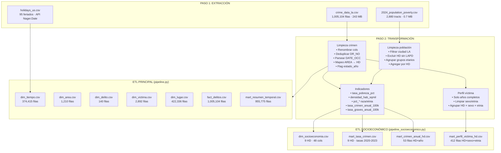

# Resumen ETL Socioeconómico — Los Angeles Crime Data
**Proyecto 1 BI — Business Analytics, Primer Semestre 2026**
**Profesora: Carla Vairetti — Universidad de los Andes**

---

## 1. Fuentes de Datos

| Archivo | Origen | Formato | Filas | Tamaño |
|---|---|---|---|---|
| `data/raw/crime_data_la.csv` | [LA Crime Data 2020–Present — data.lacity.org](https://data.lacity.org/Public-Safety/Crime-Data-from-2020-to-Present/2nrs-mtv8/about_data) | CSV, encoding latin-1 | 1,005,104 | 243.7 MB |
| `data/raw/2024_population_poverty.csv` | Censo 2024 — Condado de Los Angeles (tracts censales) | CSV, encoding UTF-8 BOM | 2,880 | 0.7 MB |
| `data/raw/holidays_us.csv` | API pública Nager.Date (`/api/v3/publicholidays/{year}/US`) | CSV generado en pipeline.py | 95 | < 1 KB |

### Descripción de cada fuente

**`crime_data_la.csv`**
Incidentes delictivos reportados al LAPD entre enero 2020 y marzo 2025. Cada fila es un incidente (DR\_NO único). Incluye fecha/hora de ocurrencia y reporte, área policial, código y descripción del delito, modus operandi, perfil de víctima (edad, sexo, origen étnico), tipo de lugar, arma usada, estado del caso, y geolocalización (LAT/LON).

**`2024_population_poverty.csv`**
Datos sociodemográficos a nivel de tract censal para el Condado de LA, año 2024. Cada fila es un tract censal e incluye: población total por sexo y grupo etario (18 rangos), población y recuento de pobreza por raza/etnia (White, Black, AIAN, Asian, HNPI, Hispanic), área en millas cuadradas y Health District (HD) al que pertenece el tract.

**`holidays_us.csv`**
Feriados federales de EE.UU. para los años 2020–2025, descargados mediante la API de Nager.Date. Se usa para enriquecer la dimensión temporal del ETL principal (`pipeline.py`). No interviene directamente en el pipeline socioeconómico.

---

## 2. Transformaciones Realizadas y Justificación

### 2.1 Preparación de datos de crimen

| Transformación | Descripción | Justificación |
|---|---|---|
| Renombrado de columnas | `str.strip().str.replace(' ', '_')` | Elimina espacios que rompen el acceso con `df['col']` |
| Parseo de `DATE_OCC` | Se prueban dos formatos (`%m/%d/%Y %I:%M:%S %p` y `%m/%d/%Y`); se acepta el que parse >90% de filas | El CSV tiene fechas con hora ("03/01/2020 12:00:00 AM") pero algunas solo tienen fecha |
| Deduplicación por `DR_NO` | `drop_duplicates(subset='DR_NO')` | `DR_NO` es el ID único de incidente; duplicados introducen conteos inflados |
| Eliminación de fechas nulas | `df[df['DATE_OCC'].notna()]` | Sin fecha de ocurrencia, el registro no es analizable temporalmente |
| Derivación de `anio` | `dt.year` sobre `DATE_OCC` | Permite agrupar por año para análisis de tendencias |
| Strip de `AREA_NAME` | `str.strip()` | Previene fallos en el mapeo LAPD → HD por espacios invisibles |
| Mapeo `AREA_NAME → hd_name` | Diccionario `LAPD_HD_MAP` (21 áreas → 9 HD) | Las 21 divisiones LAPD no coinciden con los distritos de salud del censo; se requiere una agrupación geográfica aproximada para el cruce |
| Flag `estado_anio` | `'completo'` (2020–2023), `'incompleto'` (2024), `'parcial'` (2025) | 2024 tiene ~45% menos registros (posible lag de carga); 2025 solo tiene enero–marzo. Excluir estos años del cálculo de tasas evita subestimaciones |

### 2.2 Preparación de datos de población

| Transformación | Descripción | Justificación |
|---|---|---|
| Filtro por ciudad | `df_pop[df_pop['CITY'] == 'Los Angeles']` | El dataset incluye todos los tracts del Condado; solo interesan los de la ciudad de LA (jurisdicción LAPD) |
| Exclusión de HD sin LAPD | Se excluyen `Glendale`, `Inglewood`, `San Fernando`, `South`, `Torrance` | Estos HD tienen sus propias fuerzas policiales; no hay datos LAPD para ellos y su inclusión introduciría sesgo de cobertura |
| Agregación de grupos etarios | Se suman columnas `POP24_AGE_*` en 4 grupos: `JOVENES` (0–17), `ADULTOS_JOVENES` (18–29), `ADULTOS` (30–64), `ADULTOS_MAYORES` (65+) | Reduce la dimensionalidad de 18 columnas etarias a 4 grupos interpretables en Power BI |
| Agregación por HD | `groupby('HD_name')[sum_cols].sum()` | Consolida 1,083 tracts censales en 9 Health Districts para el cruce con datos LAPD |

### 2.3 Cálculo de indicadores socioeconómicos

| Indicador | Fórmula | Justificación |
|---|---|---|
| `tasa_pobreza_pct` | `POV24_TOTAL / POP24_TOTAL × 100` | Indicador estándar de vulnerabilidad socioeconómica |
| `densidad_hab_sqmil` | `POP24_TOTAL / AREA_SQMIL` | Controla el efecto de que áreas más densas tienden a concentrar más delitos en términos absolutos |
| `pct_*` (raza/etnia) | `POP24_XXX / POP24_TOTAL × 100` | Normaliza a porcentajes para comparar HD de distintos tamaños |
| Denominador seguro | `den.replace(0, np.nan)` antes de dividir | Evita `ZeroDivisionError` o `inf` en HD con población cero (ninguno en este dataset, pero es una salvaguarda necesaria) |

### 2.4 Cálculo de tasas de crimen

| Indicador | Fórmula | Justificación |
|---|---|---|
| `delitos_por_anio` | `delitos_anos_completos / 4` | Promedio anual usando solo los 4 años completos (2020–2023); excluye 2024 y 2025 para evitar subestimación |
| `tasa_crimen_anual_100k` | `delitos_por_anio / POP24_TOTAL × 100,000` | Métrica estándar criminológica; permite comparar HD con distintas poblaciones |
| `tasa_crimen_anual_100k` en mart_anual | `total_delitos_anio / POP24_TOTAL × 100,000` | Tasa real por año (incluye 2024 y 2025 con flag de advertencia) para visualizar evolución |

### 2.5 Perfil de víctima por HD

Solo se usan años completos (2020–2023) para evitar sesgo de períodos parciales. Se agrupa por `HD_name`, `Vict_Sex` y `Vict_Descent_Desc`, contando delitos. El sexo y origen étnico ya fueron limpiados en el paso anterior.

---

## 3. Problemas de Calidad de Datos y Soluciones

| Problema | Magnitud | Solución aplicada |
|---|---|---|
| Formato de fecha inconsistente en `DATE_OCC` | Mezcla de `MM/DD/YYYY` y `MM/DD/YYYY HH:MM:SS AM/PM` | Prueba secuencial de dos formatos; si ninguno cubre >90%, se usa inferencia automática |
| Año 2024 con ~45% menos registros | 127,565 vs. ~220,000 esperados | Clasificado como `incompleto` y excluido del cálculo de tasas anualizadas; se incluye en mart evolutivo con flag visible |
| Año 2025 parcial (solo ene–mar) | 220 registros | Clasificado como `parcial`; excluido de tasas, incluido en mart con flag |
| HD del Condado sin cobertura LAPD | 5 de 14 HD en el dataset de población | Se excluyen `Glendale`, `Inglewood`, `San Fernando`, `South` y `Torrance`; documentado con razón explícita |
| Mapeo LAPD→HD no exacto | Límites administrativos no coinciden | Mapeo manual basado en ubicación geográfica aproximada (21 áreas → 9 HD). Cobertura final: **100%** de los 1,005,104 registros mapeados |
| Posible división por cero en indicadores | 0 HD con población cero en este dataset | Guardas implementadas: `replace(0, np.nan)` y validación explícita antes de calcular |
| Duplicados en `DR_NO` | Ninguno encontrado | Deduplicación preventiva aplicada |

---

## 4. Archivos de Output Generados

### 4.1 Archivos del ETL Principal (`pipeline.py`)

| Archivo | Granularidad | Filas | Cols | Tamaño | Descripción |
|---|---|---|---|---|---|
| `fact_delitos.csv` | 1 fila = 1 incidente | 1,005,104 | 28 | 205 MB | Tabla de hechos principal con todos los atributos del incidente, indicadores temporales derivados y `dias_hasta_reporte` |
| `dim_tiempo.csv` | 1 fila = combinación única de atributos temporales | 374,415 | 16 | 22.9 MB | Dimensión temporal con granularidad de 15 minutos; incluye año, trimestre, mes, semana, día, hora, bloque de 15 min, rango horario, es_finde, es_feriado |
| `dim_area.csv` | 1 fila = área policial | 1,210 | 3 | 19 KB | Dimensión geográfica con área, nombre de área y sub-distrito |
| `dim_delito.csv` | 1 fila = código de delito único | 140 | 3 | 5 KB | Código, descripción y gravedad (Part 1 o Part 2) |
| `dim_victima.csv` | 1 fila = perfil único de víctima | 2,892 | 5 | 71 KB | Edad, rango etario, sexo, código y descripción de origen étnico |
| `dim_lugar.csv` | 1 fila = combinación única de lugar | 422,336 | 6 | 33 MB | Tipo de local, descripción, dirección, calle cruzada, LAT, LON |
| `mart_resumen_temporal.csv` | Agregado: año+mes+semana+día+hora+bloque+área+tipo | 955,775 | 11 | 27.8 MB | Vista pre-agregada para dashboards rápidos en Power BI |

### 4.2 Archivos del ETL Socioeconómico (`pipeline_socioeconomico.py`)

| Archivo | Granularidad | Filas | Cols | Tamaño | Descripción |
|---|---|---|---|---|---|
| `dim_socioeconomia.csv` | 1 fila = 1 Health District | 9 | 48 | 3.4 KB | Dimensión socioeconómica completa: población total, por sexo, 18 grupos etarios, 4 grupos consolidados, 6 grupos raciales/étnicos con conteos y porcentajes, pobreza por raza, densidad y área. Solo HD con cobertura LAPD directa |
| `mart_tasa_crimen.csv` | 1 fila = 1 HD (promedio 2020–2023) | 9 | 21 | 1.7 KB | KPI central: tasa anualizada de crimen por 100,000 hab. para 2020–2023. Incluye desglose en delitos graves (Part 1) y menores (Part 2), más contexto socioeconómico |
| `mart_crimen_anual_hd.csv` | 1 fila = HD × año | 53 | 17 | 6.7 KB | Evolución anual de crimen por HD (2020–2025) con tasa por 100k, flag de estado del año (`completo`/`incompleto`/`parcial`) y contexto socioeconómico |
| `mart_perfil_victima_hd.csv` | 1 fila = HD × sexo × etnia (años completos) | 412 | 4 | 10.8 KB | Perfil de víctima por HD: combinaciones de sexo y origen étnico con conteo de delitos, basado solo en años 2020–2023 |

---

## 5. Diagrama del Flujo ETL



**Versión ASCII (alternativa):**

```
┌─────────────────────────────────────────────────────────────────┐
│                        EXTRACCIÓN                               │
│  crime_data_la.csv (243 MB)  │  2024_population_poverty.csv    │
│  1,005,104 incidentes LAPD   │  2,880 tracts censales           │
└──────────────┬───────────────┴──────────────┬───────────────────┘
               │                              │
               ▼                              ▼
┌──────────────────────────────┐  ┌───────────────────────────────┐
│     TRANSFORMACIÓN CRIMEN    │  │  TRANSFORMACIÓN POBLACIÓN     │
│  • Parseo fechas (2 formatos)│  │  • Filtrar ciudad LA          │
│  • Dedup DR_NO               │  │  • Excluir HD sin LAPD        │
│  • Mapeo AREA→HD (21→9)      │  │  • Agrupar grupos etarios     │
│  • Flag estado_año           │  │  • Agregar por HD             │
└──────────────┬───────────────┘  └──────────────┬────────────────┘
               │                                 │
               └──────────────┬──────────────────┘
                              │ JOIN por HD_name
                              ▼
┌─────────────────────────────────────────────────────────────────┐
│                    CÁLCULO DE INDICADORES                       │
│  tasa_pobreza_pct │ densidad_hab_sqmil │ tasa_crimen_anual_100k │
│  pct_* raza/etnia │ tasa_graves_anual_100k │ correlación        │
└──────────┬──────────────────┬──────────────────┬────────────────┘
           │                  │                  │
           ▼                  ▼                  ▼
┌──────────────────┐ ┌────────────────┐ ┌─────────────────────────┐
│dim_socioeconomia │ │mart_tasa_crimen│ │ mart_crimen_anual_hd    │
│  9 HD · 48 cols  │ │  9 HD · KPIs  │ │ 53 filas (HD × año)     │
└──────────────────┘ └────────────────┘ └─────────────────────────┘
                                                  +
                                        mart_perfil_victima_hd
                                           412 filas (HD×sexo×etnia)
```

---

## 6. Estadísticas Clave del Dataset

> Todas las cifras calculadas directamente de los CSV en `data/processed/`.

### 6.1 Rango de fechas

| Métrica | Valor |
|---|---|
| Fecha mínima (`DATE_OCC`) | 2020-01-01 |
| Fecha máxima (`DATE_OCC`) | 2025-03-01 |
| Total de incidentes procesados | 1,005,104 |
| Años con datos completos | 2020, 2021, 2022, 2023 |
| Año incompleto (~45% menos) | 2024 (127,565 registros) |
| Año parcial (ene–mar) | 2025 (220 registros) |

### 6.2 Top 5 áreas con más delitos (total histórico)

| Rank | Área | Delitos |
|---|---|---|
| 1 | Central | 69,674 |
| 2 | 77th Street | 61,758 |
| 3 | Pacific | 59,515 |
| 4 | Southwest | 57,499 |
| 5 | Hollywood | 52,430 |

### 6.3 Top 5 tipos de delito

| Rank | Tipo de Delito | Incidentes |
|---|---|---|
| 1 | Vehicle — Stolen | 115,230 |
| 2 | Battery — Simple Assault | 74,840 |
| 3 | Burglary from Vehicle | 63,517 |
| 4 | Theft of Identity | 62,539 |
| 5 | Vandalism — Felony ($400+) | 61,092 |

### 6.4 Registros con arma declarada

| Métrica | Valor |
|---|---|
| Registros **con** arma declarada | 327,244 (**32.6%**) |
| Registros sin arma / desconocido | 677,860 (67.4%) |

### 6.5 Completitud de datos de víctima

| Métrica | Registros | Porcentaje |
|---|---|---|
| Con dato de víctima completo (sexo F o M, edad válida) | 762,426 | 75.9% |
| Con sexo desconocido (`X`) | 242,640 | 24.1% |
| Con edad nula | 135 | < 0.1% |
| Sin dato de víctima (sexo X **o** edad nula) | 242,678 | **24.1%** |

> **Nota:** El alto porcentaje de sexo `X` (24.1%) es esperable: incluye delitos contra propiedades (robos de vehículo, vandalismo) donde no existe víctima física identificada.

### 6.6 Correlación pobreza vs. tasa de crimen

| Métrica | Valor |
|---|---|
| Pearson r (pobreza % vs. tasa crimen/100k) | **0.588** |
| Interpretación | Correlación moderada (0.4–0.7) |
| HD con mayor tasa | Southeast: 23,394/100k/año (pobreza: 26.0%) |
| HD con menor tasa | West Valley: 2,245/100k/año (pobreza: 14.1%) |

> La correlación moderada (r=0.59) confirma que la pobreza explica parcialmente la tasa de crimen, pero no es el único factor determinante. La densidad poblacional y la composición demográfica también contribuyen significativamente.

---

## 7. Notas de Uso en Power BI

### Relaciones entre tablas (ETL Principal)
- `fact_delitos` → `dim_tiempo` vía `DATE_OCC`
- `fact_delitos` → `dim_area` vía `AREA`
- `fact_delitos` → `dim_delito` vía `Crm_Cd`
- `mart_resumen_temporal` se carga directamente como tabla de hechos pre-agregada para dashboards de alto nivel

### Integración del análisis socioeconómico
- `mart_tasa_crimen` y `mart_crimen_anual_hd` se conectan a `dim_socioeconomia` vía `HD_name`
- Al filtrar por `estado_anio = 'completo'` en `mart_crimen_anual_hd` se obtiene la serie temporal limpia (2020–2023)
- Para comparativas de tasas, usar siempre `mart_tasa_crimen` (base 2020–2023) como referencia

### KPIs recomendados con este cruce
- Scatter plot: `tasa_crimen_anual_100k` vs. `tasa_pobreza_pct` por HD
- Mapa coroplético: tasa de crimen coloreada por nivel de pobreza
- Perfil comparativo: distribución étnica de víctimas vs. distribución étnica de población (detecta sobre/sub-representación)

---

*Documento generado el 2026-03-29.*
*Scripts: `etl/pipeline.py` (ETL principal) · `etl/pipeline_socioeconomico.py` (cruce socioeconómico)*
